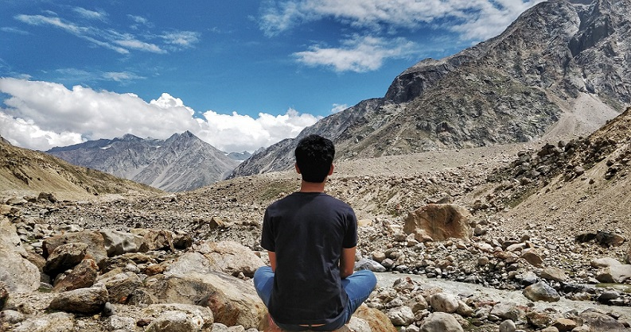

Hi, I'm Abhinav Dinesh, a frontend developer and UX designer. Currently working in a lead/architect role at a *young* product startup based in the middle east. **JavaScript**, **Angular**, **React** are my potions of choice for conjuring up any deadly beast. **GatsbyJs** and **GraphQL** are currently brewing in my basement lab to cook up a super *fast, secure and fancier* beast.

After completing under graduation in Computer Science, I have worked as a *Product Solution Engineer* in a product startup disrupting the dental health care scene in the United States. Now I'm looking forward to locking horns with the industry leaders in ERP solutions in the middle eastern countries.

When I'm not coding, I'm either listening to some all time classics or home grown indie music, on my beloved RHA earphones. I also travel, although not as much I want to. Reading is a newly acquired habbit thanks to my interest in self help books and my kindle. Productivity tools like Notion and Daylio are my pills for better time mangement and habit tracking.

I undertake freelance projects which I find challenging and/or fun. I answer on stackoverflow and also work on side projects when I get some free time, you can find in my github page. Drop me a mail at abhinavdinesh@live.com if you want to collaborate, discuss your ideas, hire me for a freelance project or just chat. 